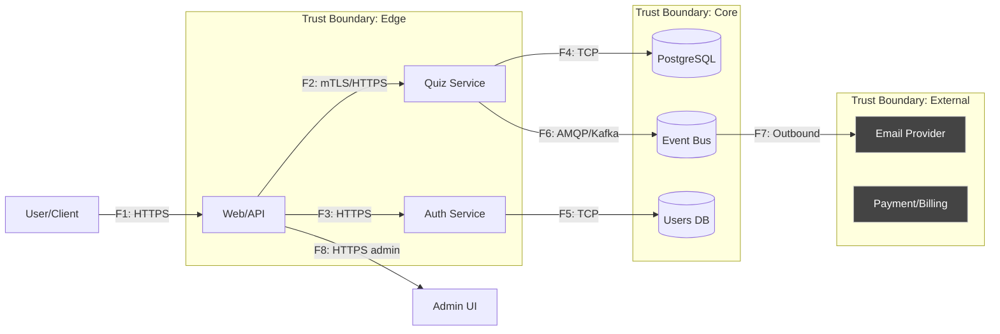

Ниже — DFD уровня L1 для моего сервиса (контекст: веб-платформа квизов). Отмечены границы доверия и ключевые потоки `F1…F8`.

| ID | Откуда → Куда              | Канал/протокол | Данные/PII              | Комментарий                |
| -- | -------------------------- | -------------- | ----------------------- | -------------------------- |
| F1 | User → Web/API             | HTTPS          | creds, cookies          | вход/регистрация/квиз      |
| F2 | Web/API → Quiz Service     | mTLS/HTTPS     | session, quiz data      | внутренний API             |
| F3 | Web/API → Auth             | HTTPS          | creds, tokens           | обмен токенами             |
| F4 | Quiz Service → PostgreSQL  | TCP            | quiz/answers/PII        | ORM/DRIVER                 |
| F5 | Auth → Users DB            | TCP            | password hash, PII      | хранение пользователей     |
| F6 | Quiz Service → Event Bus   | AMQP/Kafka     | events (PII минимально) | нотификации/аналитика      |
| F7 | Event Bus → Email Provider | HTTPS          | email, template vars    | внешняя интеграция         |
| F8 | Admin UI → Web/API         | HTTPS          | admin session           | управление курсами/квизами |
